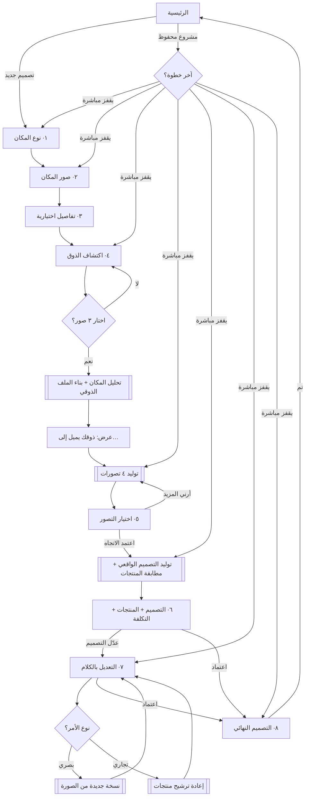

# ٥ — رحلة المستخدم

## الرحلة الكاملة

---

## المبادئ التي تحكم التدفق

### ١ · لا يفقد المستخدم عمله أبداً (البند ٢٦)
`currentStep` جزء من المشروع نفسه ويُحفظ خلال ٤٠٠ مللي ثانية من أي تغيير.
إغلاق التطبيق في أي لحظة → فتح المشروع يعود لنفس النقطة.
لا يوجد زر «حفظ» في أي شاشة — وجوده يعني أن النسيان ممكن.

### ٢ · الرجوع لا يهدم شيئاً
الرجوع من أي خطوة يبقي كل ما أُنجز. تغيير اختيار الذوق يلغي **الملف الذوقي فقط**، لا الصور ولا التفاصيل.

### ٣ · شروط الانتقال صريحة

| الخطوة | لا يتقدّم حتى |
|---|---|
| نوع المكان | يُختار نوع |
| الصور | صورة واحدة على الأقل |
| التفاصيل | — (اختيارية بالكامل) |
| الذوق | ٣ صور على الأقل |
| التصورات | يُختار تصور |
| التصميم | يكتمل التوليد |

الزر يبقى معطّلاً مع سبب مكتوب تحته — لا ضغطة تفشل بصمت.

### ٤ · العرض التدريجي
التصورات تظهر واحداً تلو الآخر فور جاهزيته. المستخدم يبدأ بالنظر بعد ~٧ ثوانٍ بدل الانتظار حتى تكتمل الدفعة.

### ٥ · التعديل لا يهدم (البند ١٩)
كل تعديل = **نسخة جديدة**. الرجوع لنسخة سابقة يغيّر مؤشراً ولا يحذف شيئاً. النسخ كلها تبقى متاحة في شريط أفقي.

---

## حالات الخطأ (البند ٢٥)

| ماذا يحدث | ما يراه المستخدم | ما يستطيع فعله |
|---|---|---|
| صورة تالفة أو غير مدعومة | «حدث خطأ… جرّب مرة أخرى» | يعيد الرفع |
| صورة غير واضحة | «الصورة غير واضحة. جرّب صورة أوضح بإضاءة أفضل.» | يعيد التصوير |
| صورة مظلمة | «الصورة مظلمة. صوّر المكان بإضاءة أقوى.» | يعيد التصوير |
| صورة فيها أشخاص | «الصورة تحتوي على أشخاص. صوّر المكان فارغاً.» | يعيد الرفع |
| فشل التوليد | «تعذّر إنشاء التصميم هذه المرة.» + زر إعادة | يعيد المحاولة |
| انقطاع الإنترنت | «لا يوجد اتصال بالإنترنت.» | يحاول لاحقاً — عمله محفوظ |
| لا منتج مطابق | «لم نجد منتجات مشابهة لهذا العنصر.» | يتجاهل أو يبحث بنفسه |
| فشل السعر | «السعر غير متوفر» — بلا رقم مخترع | يفتح المتجر بنفسه |
| أمر تعديل غير مفهوم | «لم أفهم… جرّب صياغة أوضح مثل…» | يعيد الصياغة |
| التخزين ممتلئ | «مساحة التخزين ممتلئة. احذف مشروعاً قديماً.» | يحذف مشروعاً |

**لا رسالة تقنية واحدة.** لا «API Error 500» ولا رمز خطأ ظاهر للمستخدم.

---

## حالات التحميل (البند ٢٤)

| المرحلة | النص |
|---|---|
| `analyzing_space` | نحلّل مساحة الغرفة… |
| `building_profile` | نحلّل ذوقك… |
| `generating_concepts` | نبني التصورات… |
| `rendering_design` | نجهّز التصميم… |
| `matching_products` | نبحث عن منتجات مشابهة… |
| `applying_edit` | نطبّق التعديل… |

**التزام:** كل نص مربوط بمرحلة **فعلية** يبلّغ عنها المزوّد عبر `onProgress`. لا مؤقّت يبدّل النصوص ليوهم المستخدم بعمل لا يحدث — هذا نص البند ٢٤ حرفياً.

الشاشة تعرض المراحل كقائمة: المنتهية بنقطة خضراء، الجارية بنقطة نابضة، القادمة رمادية. المستخدم يرى أين وصل وكم بقي.
